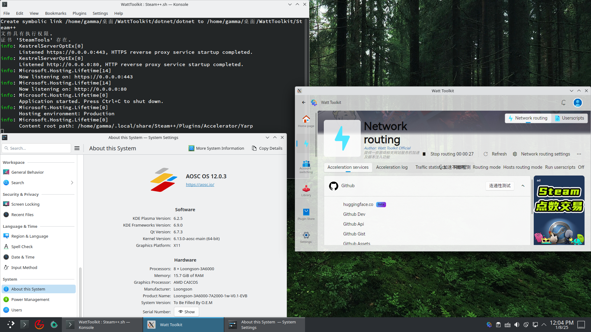
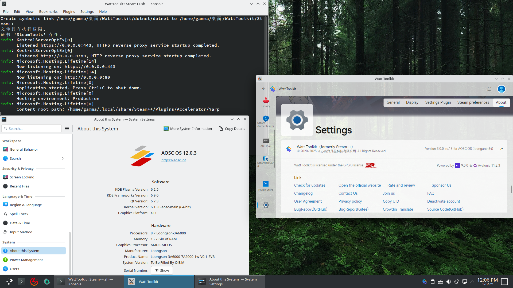

<h1 align="center">Watt Toolkit 🧰 (Former name Steam++)</h1>

English | [简体中文](./README.md)

"Watt Toolkit" is an open source cross-platform multi-purpose game toolkit, most of its features require you to download and install Steam to use it.

## 🚀 Download Channels
- 
- [Official WebSite](https://steampp.net)
- [GitHub Releases](https://github.com/BeyondDimension/SteamTools/releases)
- [Gitee Releases](https://gitee.com/rmbgame/SteamTools/releases)
- [Arch User Repository](https://aur.archlinux.org/packages/watt-toolkit-bin)(Current release build)
- [Arch User Repository dev](https://aur.archlinux.org/packages/watt-toolkit-git)(Pull the latest source code build, maybe the build will fail)

## ⬇️ [Download Guide](./doc/download-guide.en.md)
See details [./doc/download-guide.en.md](./doc/download-guide.en.md)  

## ✨ Functions
1. Account Switch   
	- Switch between Steam accounts that are already logged in on the current PC with one click, and manage features such as sorting your home shared library.
2. Inventory Management   
	- Lets you manage your Steam game inventory directly, not only by downloading older Steam games, but also by managing Steam game achievements directly, supporting unlocked achievements and unlocked achievements.
3. Local Authentication     
	- Let your cell phone token unified save in the computer, currently only support Steam token, later will develop support more token types with cloud synchronization token.
4. ArchiSteamFarm     
	- Integration with [ArchiSteamFarm](https://github.com/JustArchiNET/ArchiSteamFarm) provides functions such as hanging and dropping Steam Collectible Cards within the app.
5. Game Tools 
	- Force game windows to use borderless windowing

## 🖥️ Supported Operating Systems
### The operating systems listed below are all x86-64 versions of the respective operating systems. Users of older Windows versions such as Windows 7, 8.1, or 32-bit operating systems are advised to download the older versions from the Release section for use.
### ARM Processor users, please download the stable version from the Release section or build it yourself.
### The LoongArch64 version is currently in the dev build stage, and stable software packages have not yet been built. Please wait. To run the LoongArch64 version of Watt Toolkit, you need to meet the requirements of Linux kernel>=6.6 and glibc>=2.40. Users of deepin 23 and loongnix 25 need to first run "sudo apt install libpng-dev" before being able to use the software normally.
- Windows 11
- Windows 10 version 1809(OS internal version 17763) or higher is required
- macOS 10.15 or higher is required
- Ubuntu 20.04 or higher is required
- Debian 11 or higher is required
- Fedora 37 or higher is required
- Deepin(UOS) 20 or higher is required
- ~~iOS 11 or higher is required~~(In development…)
- Android 5.0(API 21) or higher is required
- AOSC OS 12(Localhost) or higher is required

## 🔲 Supported Processors
### X86 Processor
- An x86-64 CPU that meets or exceeds the minimum requirements for the installation of the aforementioned operating system
- For Zhaoxin processors, it is recommended to use KX-U6780A or above to ensure smooth program execution.
### ARM Processor
- CPUs supporting ARM V8 (aarch64) or above
- For Phytium processor, it is recommended to use the Phytium D2000 or above to ensure smooth program execution.
### Loongson Processor
- LoongArch64 CPUs with LSX extension instructions, such as 3A5000 and above. MIPS (LoongISA), LoongArch32, or CPUs without LSX extension instructions, such as 3A4000 and 2K0300, are not supported.

## 🧩 Screenshots

 

 

 

 
 

## 🌏 Roadmap
Read what we [milestones](https://github.com/BeyondDimension/SteamTools/milestones), and feel free to ask questions.

## ⌨️ Development Environment
### Windows and Mac
[Visual Studio 2022](https://visualstudio.microsoft.com/vs)  
[Visual Studio 2022 for Mac](https://visualstudio.microsoft.com/vs/mac)  
[JetBrains Rider](https://www.jetbrains.com/rider)  
[Visual Studio Code](https://code.visualstudio.com)  
[OpenJDK 17](https://learn.microsoft.com/en-us/java/openjdk/download#openjdk-17)  
[Android Studio Electric Eel Or Higher](https://developer.android.com/studio)  
[Xcode 14 Or Higher](https://developer.apple.com/xcode)  

### Special Requirements for Building LoongArch64 Version
The LoongArch64 version of Watt Toolkit only supports building on LoongArch64 physical machines with LSX, such as Loongson 3A5000 and above; or using X86 Linux to cross compilated dotnet 9. The building principles follow the [Software Development and Build Convention for LoongArch™ Architectures](https://github.com/loongson/la-softdev-convention).
The LoongArch64 version only builds the New World version.
- System requirements
	- [AOSC OS 12 or higher is required](https://aosc.io/download)
	- loongnix 25 or higher is required
	- [Deepin 25 or higher is required](https://www.deepin.org/zh/download/)
	- Yongbao 2.9 or higher is required
	- [Alpine Linux 3.21.0 or higher is required](https://alpinelinux.org/downloads/)
	- [GXDE OS 15.14.2 or higher is required](https://www.gxde.top/)
	- [Debian 13 or higher is required](https://www.debian.org/)
- Work load
	- .NET version
		- [.NET 9.0 and above](https://github.com/loongson-community/dotnet-unofficial-build)
	- vscodium
		- [vscodium 1.96.2.24355 and above](https://github.com/VSCodium/vscodium)
	- Web and Cloud
		- ASP.NET and Web Development
	- Desktop applications
		- .NET desktop development

### Due to the fact that the new world NuGet has not yet been fully upstreamed, the LoongArch64 version of this project uses the NuGet source provided by [Loongson Open Source Community](https://nuget.loongnix.cn) to provide SkiaSharp, HarfBuzzSharp, etc. This also allows compatibility with the three old world distributions: Loongnix 20, UOS 20, and Kylin.
### Users of the LoongArch64 in the old world can download the .NET 9 and later versions from the [Loongson Open Source Community](https://www.loongnix.cn/zh/api/dotnet/) to compile this project. For common issues, please refer to the [reference documentation](https://docs.loongnix.cn/dotnet/support/list/01.%E5%B8%B8%E8%A7%81%E9%97%AE%E9%A2%98-FAQ.html#%E9%BE%99%E8%8A%AFnuget%E6%BA%90%E7%9A%84%E9%85%8D%E7%BD%AE%E6%96%B9%E6%B3%95).
### When compiling this project for users of the new world architecture, there is a possibility of incorporating old world binary files. It is recommended to install the [liblol old world compatibility tool](https://liblol.aosc.io) to ensure normal compilation and operation. AOSC OS, Deepin 23, and Yongbao generally come with liblol preinstalled, so no additional installation is required.

## 🏗️ Project Structure
See details&nbsp;&nbsp;[./src/README.md](./src/README.md) 

## 📄 Open Source Library
See details&nbsp;&nbsp;[./doc/open-source-library.md](./doc/open-source-library.md)  
