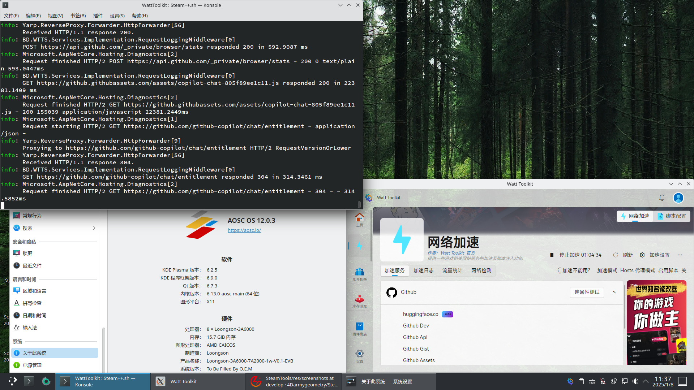
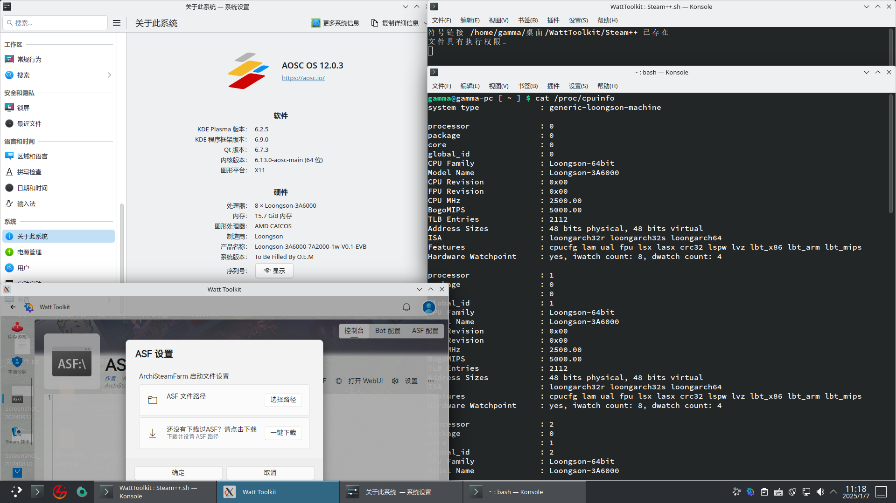
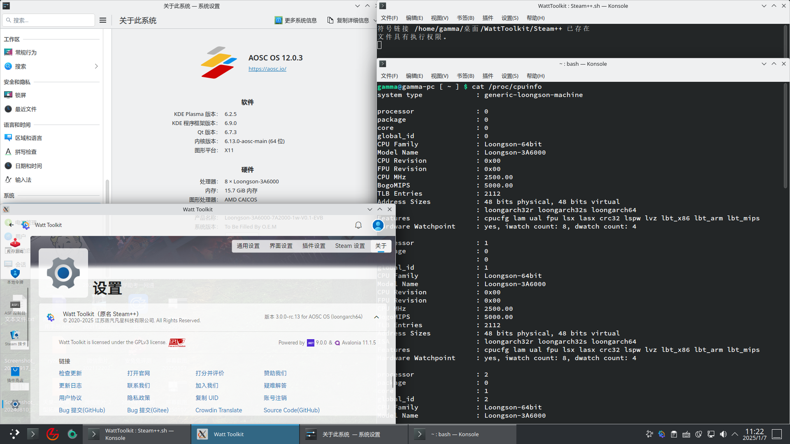

<h1 align="center">Watt Toolkit 🧰 (原名 Steam++)</h1>

[English](./README.en.md) | 简体中文

「Watt Toolkit」是一个开源跨平台的多功能游戏工具箱，此工具的大部分功能都是需要您下载安装 Steam 才能使用。
 

## 🚀 下载渠道
- 
- 
- [软件官网](https://steampp.net)
- [GitHub 发行版](https://github.com/BeyondDimension/SteamTools/releases)
- [码云 发行版](https://gitee.com/rmbgame/SteamTools/releases)
- [Arch 用户仓库](https://aur.archlinux.org/packages/watt-toolkit-bin)（当前 Release 构建）
- [Arch 用户仓库 dev](https://aur.archlinux.org/packages/watt-toolkit-git)（拉取最新源码构建，也许会构建失败）

## ⬇️ [下载指南](./doc/download-guide.md)
详见 [./doc/download-guide.md](./doc/download-guide.md)  

## ✨ 功能
全新的 3.0 版本，支持自定义插件功能，以下功能为下载时自带的默认插件，可以自行删除或禁用。
1. 网络加速     
	- 使用 [YARP.ReverseProxy](https://github.com/microsoft/reverse-proxy) 开源项目进行本地反代来支持更快的访问游戏网站。
	- 通过加速服务拦截网络请求将一些 JS 脚本注入在网页中，提供类似网页插件的功能。
3. 账号切换   
	- 快速切换已在当前 PC 上登录过的 Steam、Epic、Uplay 等等多平台账号，与管理 Steam 家庭共享库排序及禁用等功能。
4. 库存游戏   
	- 直接管理你的 Steam 游戏库存，可以编辑游戏名称和[自定义封面](https://www.steamgriddb.com)。
	- 监控 Steam 游戏下载进度实现 Steam 游戏下载完成定时关机功能。
	- 模拟运行 Steam 游戏，让您不用安装和下载对应的游戏也能挂游玩时间和掉落 Steam 卡片
	- 自助管理 Steam 游戏云存档，随时删除和上传自定义的存档文件至 Steam 云。
	- 解锁以及反解锁 Steam 游戏成就。
5. 本地令牌     
	- 让您的手机令牌统一保存在电脑中、支持通用HOTP、TOTP、Steam、Google 等令牌导入。
	- 支持 Steam 登录账号自定绑定生成令牌、支持 Steam 批量确认交易功能。
6. ~~自动挂卡(新版本开发中)~~     
	- ~~集成 [ArchiSteamFarm](https://github.com/JustArchiNET/ArchiSteamFarm) 在应用内提供 挂机掉落 Steam 集换式卡牌 等功能。~~
7. 游戏工具 
	- 强制游戏窗口使用无边框窗口化、更多功能待开发。

## 🖥️ 支持的操作系统
### 下面所列操作系统为该操作系统的x86-64版本。Windows 7、8.1等旧版Windows用户、Windows 10版本低于1809的用户或32位操作系统用户请在Release中下载旧版使用。
- Windows 11
- Windows 10 版本 1809（OS 内部版本 17763）或更高版本
- macOS 10.15 或更高版本
- Ubuntu 20.04 或更高版本
- Debian 11 或更高版本
- Fedora 37 或更高版本
- Deepin(UOS) 20 或更高版本
- AOSC OS 12(Localhost) 或更高版本
- 中科方德桌面版 5.0 或更高版本
### ARM PC用户请下载Release中的稳定版或自行构建，手机用户支持如下版本：
- Android 5.0(API 21) 或更高版本
- ~~iOS 11 或更高版本~~（开发中…）
- 使用鸿蒙系统的手机用户等后续适配。
### 龙芯用户请下载Release中的测试版。运行Watt Toolkit龙芯版需达到Linux内核>=6.6、glibc>=2.40的要求（deepin 23除外）。下列为龙芯版目前所适配的操作系统（均为新世界系统）：
- [Deepin 23 或更高版本](https://www.deepin.org/zh/download/)
- [AOSC OS 12 或更高版本](https://aosc.io/download)
- Loongnix 25 或更高版本
- [Loongnix Server 23.1 或更高版本](http://pkg.loongnix.cn/loongnix-server/23.1/isos/)
- [Yongbao 2.10 或更高版本](https://mirrors.wsyu.edu.cn/fedora/linux/Yongbao/2.10/) 16K内核
### 常见问题
#### Deepin 23：
- error while loading shared libraries: unexpected reloc type 0x0e

原因：glibc版本过旧

解决办法：sudo apt update，再sudo apt dist-upgrade，将龙架构deepin 23升级至最新版
- certutil: function failed: SEC_ERROR_BAD_DATABASE: security library: bad database

原因：主文件夹中没有.pki文件夹或内容存在问题

解决方法：手动运行脚本中的environment_check.sh，重新生成文件夹
#### Yongbao（勇豹）：
- error while loading shared libraries: cannot apply additional memory protection after relocation: Cannot allocate memory

原因：使用4K内核启动勇豹系统，目前加速功能仅能在16K LoongArch64内核下正常工作

解决方法：换16K内核启动，或者忽略警告，使用除加速功能外的其他功能
- Failed to load System.Private.CoreLib.dll (error code 0x8007000E)
Path: ./WattToolkit/dotnet/shared/Microsoft.NETCore.App/9.0.0/System.Private.CoreLib.dll
Error message: Out Of Memory
Failed to create CoreCLR, HRESULT: 0x8007000E

原因：使用64K内核启动勇豹系统，软件目前不支持该内核

解决方法：换16K内核启动
- pkexec must be setuid root

原因：pkexec未获得权限

解决方法：sudo chmod u+s $(which pkexec)
- StartProxyFail: BindPortError

原因：勇豹只支持System代理加速

解决方法：将host代理加速改成system代理加速
## 🔲 支持的处理器
### X86处理器
- 满足上述操作系统安装最低要求及以上的的x86-64 CPU
- 对于兆芯处理器，建议使用KX-U6780A及以上处理器以保障程序可以流畅运行。
### ARM处理器
- ARM V8(aarch64)及以上CPU
- 对于飞腾处理器，建议使用飞腾D2000及以上处理器以保障程序可以流畅运行。
### 龙芯
- 3A5000及以上含有LSX扩展指令的LoongArch64 CPU。MIPS(LoongISA)、LoongArch32或不含有LSX扩展指令的，如3A4000、2K0300，在此不受支持。

## 🧩 截图

 

 

 

 

 

 
 
<!---->

## 从移动端 Steam App 导入令牌指南
- [Android 添加本地令牌（Xposed）](https://github.com/BeyondDimension/SteamTools/issues/2276)
- [iOS 添加本地令牌（无需越狱/网络抓包）](https://github.com/BeyondDimension/SteamTools/issues/2129)
- [iOS 添加本地令牌（无需越狱/iTunes 备份）](https://github.com/BeyondDimension/SteamTools/issues/299)
- [iOS 添加本地令牌（需越狱）](https://github.com/BeyondDimension/SteamTools/issues/95)

## 🌏 路线图
查看这个 [milestones](https://github.com/BeyondDimension/SteamTools/milestones) 来了解我们下一步的开发计划，并随时提出问题。

## ⌨️ 开发环境
### Windows与Mac环境构建要求
[Visual Studio 2022](https://visualstudio.microsoft.com/zh-hans/vs) 或 [Visual Studio 2022 for Mac](https://visualstudio.microsoft.com/zh-hans/vs/mac)     
- 系统要求
	- [Windows 11 版本 21H2 或更高版本：家庭版、专业版、专业教育版、专业工作站版、企业版和教育版](https://learn.microsoft.com/zh-cn/visualstudio/releases/2022/system-requirements)
	- [macOS Big Sur 11.0 或更高版本](https://learn.microsoft.com/zh-cn/visualstudio/releases/2022/mac-system-requirements)
- 工作负荷
	- Web 和云
		- ASP.NET 和 Web 开发
	- 桌面应用和移动应用
		- 使用 .NET 的移动开发 / .NET Multi-platform App UI 开发
		- .NET 桌面开发
		- 通用 Windows 平台开发
- 单个组件
	- GitHub Extension for Visual Studio(可选)
- [Visual Studio Marketplace](https://marketplace.visualstudio.com)
	- [Avalonia for Visual Studio(可选)](https://marketplace.visualstudio.com/items?itemName=AvaloniaTeam.AvaloniaVS)  
	- [NUnit VS Templates(可选)](https://marketplace.visualstudio.com/items?itemName=NUnitDevelopers.NUnitTemplatesforVisualStudio)  

[JetBrains Rider](https://www.jetbrains.com/rider)  
[Visual Studio Code](https://code.visualstudio.com)  
[OpenJDK 17](https://learn.microsoft.com/zh-cn/java/openjdk/download#openjdk-17)  
[Android Studio Electric Eel 或更高版本](https://developer.android.google.cn/studio)  
[Xcode 14 或更高版本](https://developer.apple.com/xcode)  

### 龙芯版构建特殊要求
详见&nbsp;&nbsp;[./doc/loongson-build.md](./doc/loongson-build.md)

## 🏗️ [项目结构](./src/README.md)
详见&nbsp;&nbsp;[./src/README.md](./src/README.md)  

## 🧑‍💼 加入我们
- [.NET/C# 高级软件工程师（客户端方向）](https://www.zhipin.com/job_detail/b271a34a3efeb84c1XJ_2dW6ElVT.html)
- [.NET/C# 高级软件工程师](https://www.zhipin.com/job_detail/0164142566ff52d71XJ_2dW7GVVW.html)

<!--
- [.NET/C# 软件工程师](https://www.zhipin.com/job_detail/80c0ad0f424e2ea61XJ_2t6-GVVZ.html)
- [高级 Web 前端工程师](https://www.zhipin.com/job_detail/e59317c527f3f49e1XJ92d24FVRV.html)
-->

## 📄 [开源代码库](./doc/open-source-library.md)  
详见&nbsp;&nbsp;[./doc/open-source-library.md](./doc/open-source-library.md)  
